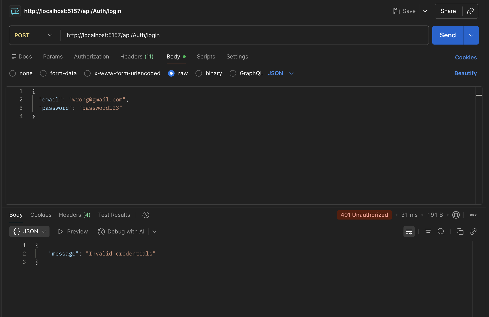
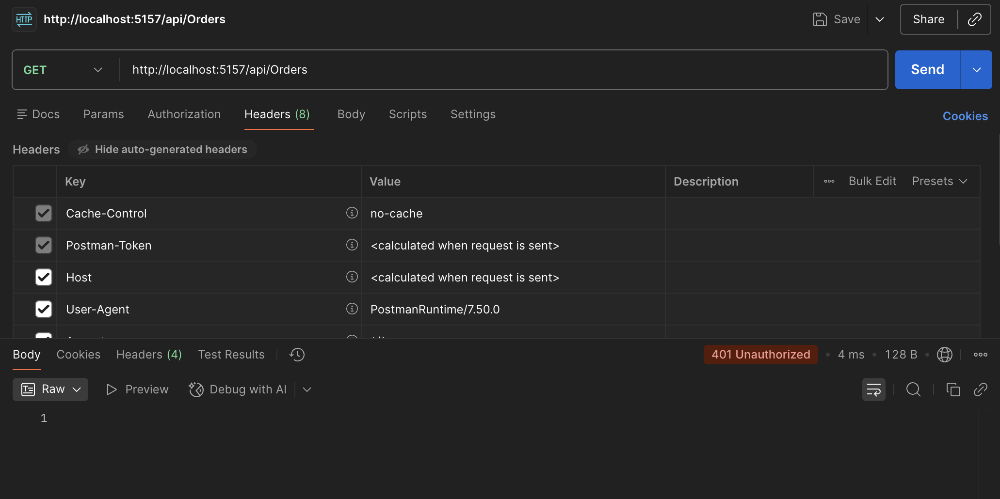

# Guvi-DotNet-Assignment-29Nov

I have used Local SQL (SQLite instead of SQL server as i am doing this on MAC.) - We can also implement SQL server on Docker but that will make project more bulky and hard to submit my assignment.

## File Structure

## Registration

## Login

## Invalid Login

## Unauthorised api call

# CRUD Operations

## Authorised POST request

## Authorised GET request

## Authorised PUT request

## Authorised DELETE request
